# Filipino-Family-Income-and-Expenditure-Project
Analyzing poverty drivers and consumption patterns across 40,000+ Philippine households to uncover insights into urban/rural economic disparities.

# Project Name

## 📄 Documentation

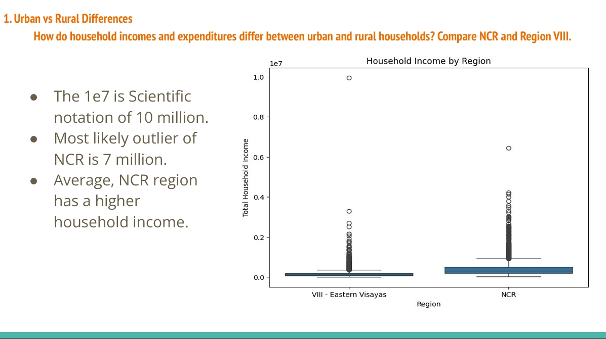
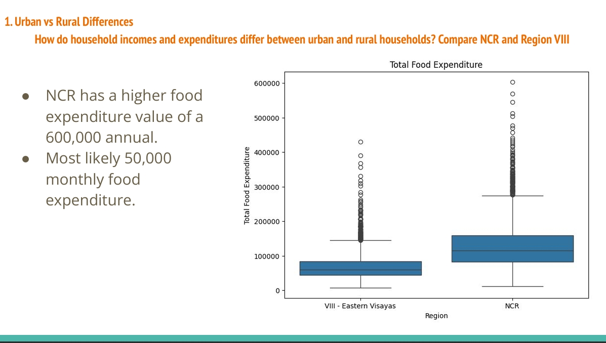

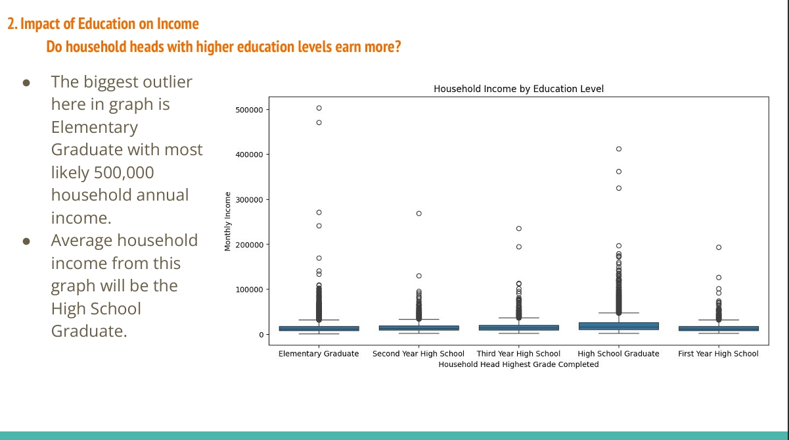
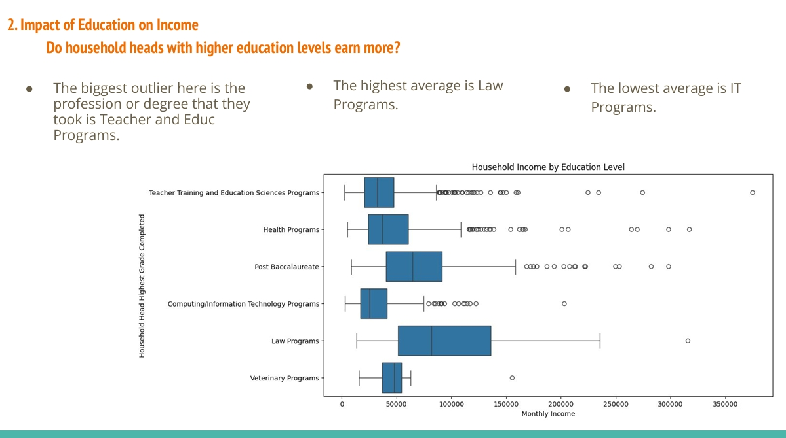
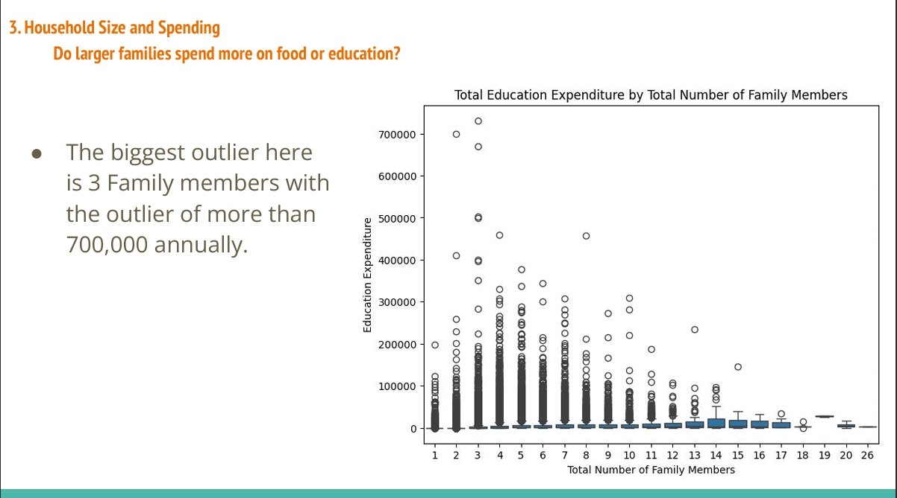
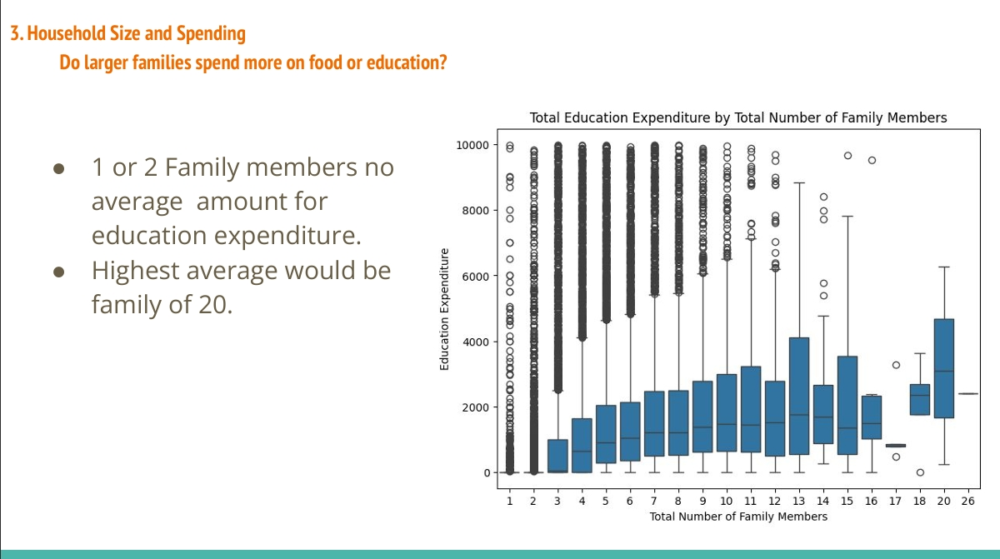
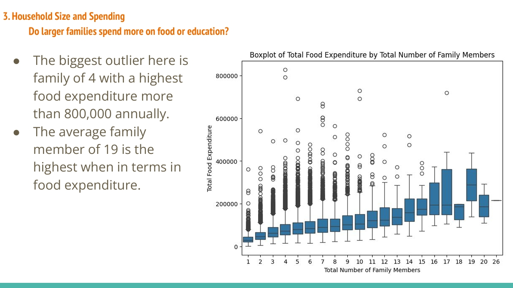
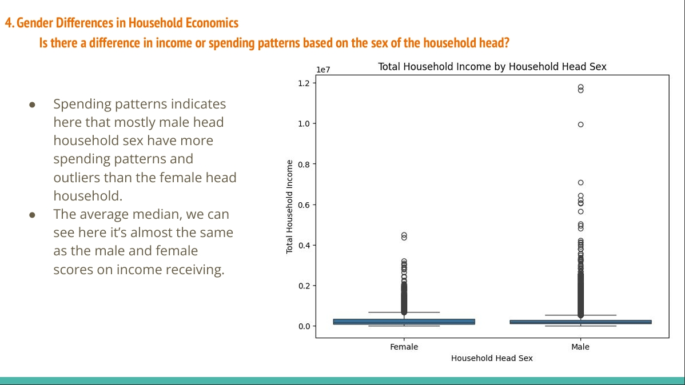
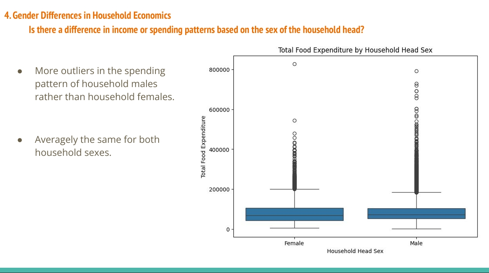
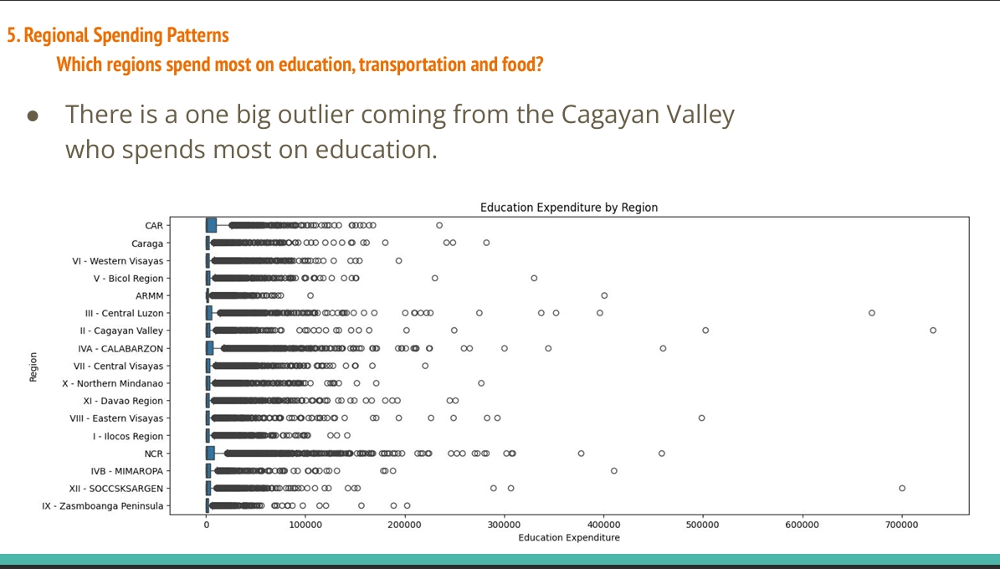
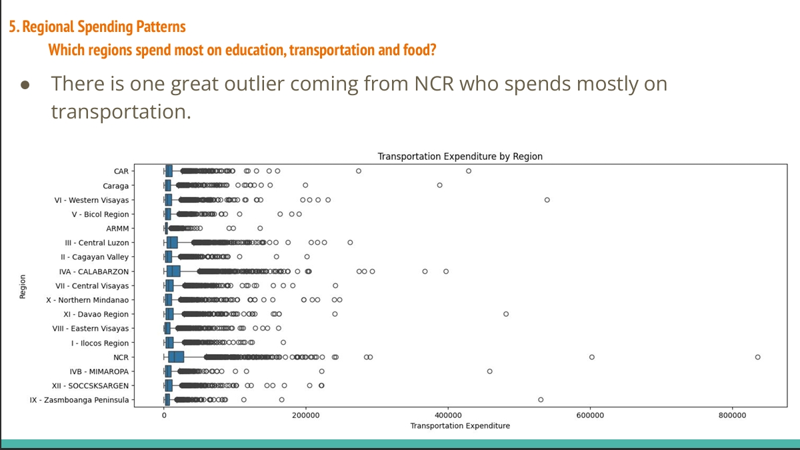
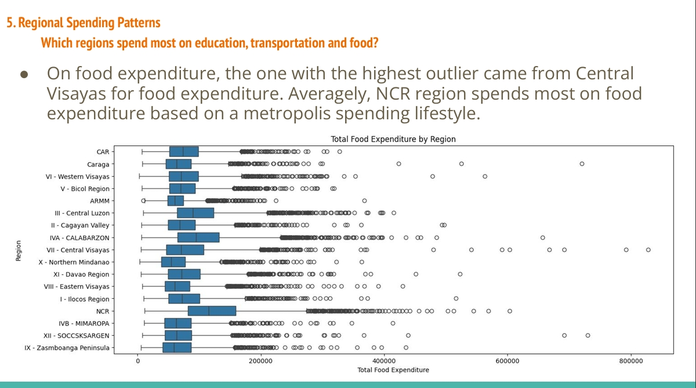
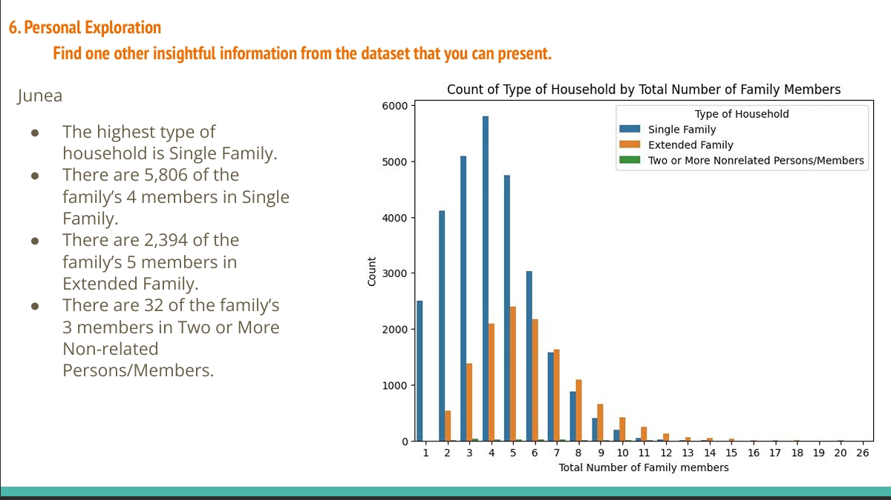
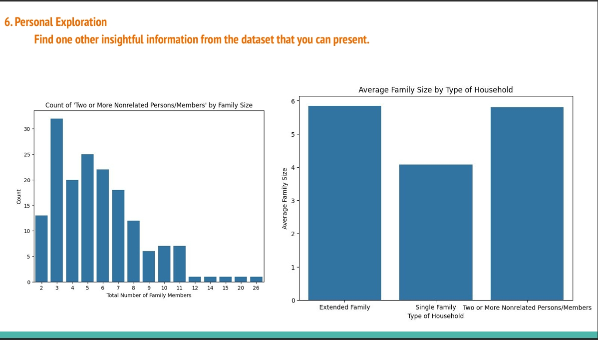
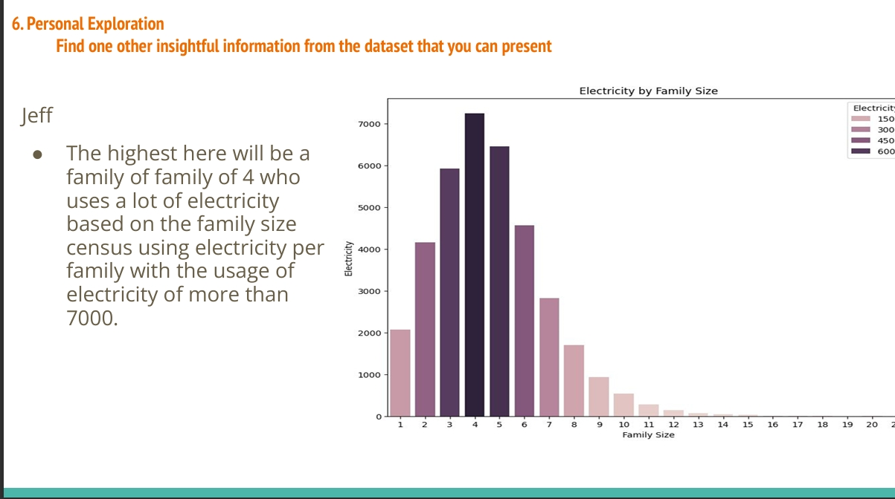
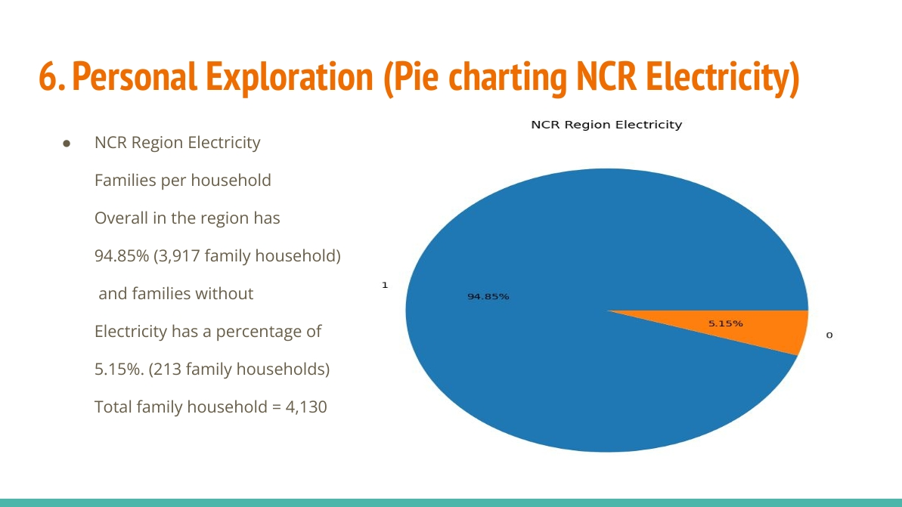
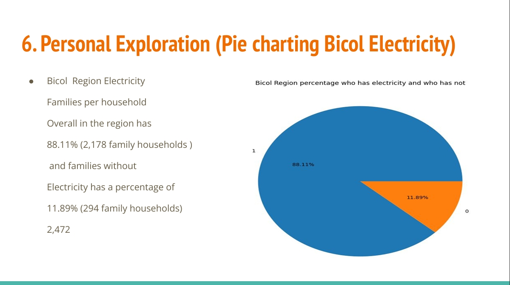
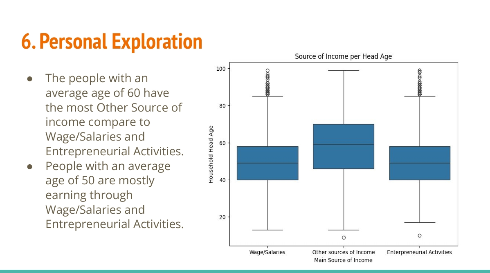

Click the image above to view the full PDF

## 📁 Files

| File | Description |
|------|-------------|
| [sample.pdf](./sample.pdf) | Project documentation |
| [sample.csv](./sample.csv) | Dataset |
| [notebook.ipynb](./notebook.ipynb) | Jupyter notebook with analysis |

## 🚀 Getting Started

1. Clone the repository
2. Open the Jupyter notebook
3. Run the cells to analyze sample.csv

---

Made with ❤️